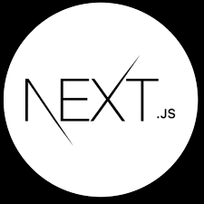
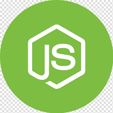

 

# Hi, I'm Sajid Hussain

### MERN Stack Developer

I love being creative and aspiring the interesting dreams.

I've always been a person who if something fascinates me then 🔎 I'd find out how to do it, so programming has been a perfect fit for me. I love programming in all aspects but especially, my deep interest lies in Web development. I love reading books and playing cricket.  
 💻 Web Developer | 📚 Bookworm | 🏏 Cricket Enthusiast

## 🔥 Languages & Frameworks & Libraries & Tools & Abilities 🔥

<!-- C++ Logo -->

<!-- JS Logo -->

<!-- TS Logo -->

<!-- Reactjs Logo -->

<!-- Nextjs Logo -->

<!-- Nodejs Logo -->

<!-- Express Logo -->

<!-- Mongodb Logo -->

<!-- Postgree db Logo -->

<!-- Html Logo -->

<!-- Css Logo -->

<!-- Material-UI Logo -->

<!-- Tailwindcss Logo -->

<!-- Git Logo -->

<!-- GitHub Logo -->

<!-- Add more logos as needed -->

## ⚡ Statistics ⚡</h2>

